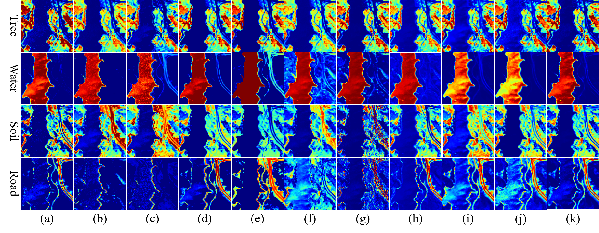

# UNMamba: Cascaded Spatial-Spectral Mamba for Blind Hyperspectral Unmixing
This paper has been accpeted by IEEE Geoscience and Remote Sensing Letters (GRSL) and can be downloaded [here](https://ieeexplore.ieee.org/document/10902420).
# Getting Started

## Introduction
Blind hyperspectral unmixing (HU) has advanced significantly with the emergence of deep learning-based methods. However, the localized operations of convolutional neural networks (CNNs) and the high computational demands of Transformers present challenges for blind HU. This necessitates the development of image-level unmixing methods capable of capturing long-range spatial-spectral dependencies with low computational demands. This paper proposes a cascaded spatial-spectral Mamba model, termed UNMamba, which leverages the strengths of Mamba to efficiently model long-range spatial-spectral dependencies with linear computational complexity, achieving superior image-level unmixing performance with small parameters and operations.
Specifically, UNMamba first captures long-range spatial dependencies, followed by the extraction of global spectral features, forming long-range spatial-spectral dependencies, which are subsequently mapped into abundance maps. Then, the input image is reconstructed using the linear mixing model (LMM), incorporating weighted averages of multiple trainable random sequences and an endmember loss to learn endmembers. UNMamba is the first unmixing approach that introduces the state space models (SSMs). Extensive experimental results demonstrate that, without relying on any endmember initialization techniques (such as VCA), the proposed UNMamba achieves significantly high unmixing accuracy, outperforming state-of-the-art methods.


## Results on Jasper Ridge

(a)-(k) GT, FCLSU, SNMF-Net, DAEU, SIDAEU, MLAEM, DeepTrans, MLM-1DAE, A2SN, A2SAN and UNMamba.

## Installation

```bash
conda create -n UNMamba_env python=3.9
conda activate UNMamba_env
conda install pytorch==2.2.2 torchvision==0.17.2 torchaudio==2.2.2 pytorch-cuda=12.1 -c pytorch -c nvidia
pip install causal_conv1d
pip install mamba-ssm==1.2.0.post1
pip install spectral
pip install scikit-learn==1.4.1.post1
pip install calflops
pip install matplotlib
pip install torchsummary
```

## Training
```bash
python main_UNMambaLinear_JR.py
python main_UNMambaLinear_AP.py
python main_UNMambaLinear_UR.py
```


## Citation
If you find this project helpful for your research, please kindly consider citing this paper:
```bash
@ARTICLE{10902420,
  author={Chen, Dong and Zhang, Junping and Li, Jiaxin},
  journal={IEEE Geoscience and Remote Sensing Letters}, 
  title={UNMamba: Cascaded Spatial-Spectral Mamba for Blind Hyperspectral Unmixing}, 
  year={2025},
  volume={},
  number={},
  pages={1-1},
  keywords={Blind hyperspectral unmixing;linear mixing model;endmember loss;mamba;state space model},
  doi={10.1109/LGRS.2025.3545505}}
```
## Acknowledgements
Part of our UNMamba is referred to [MambaHSI](https://github.com/li-yapeng/MambaHSI) and [DeepTrans](https://github.com/preetam22n/DeepTrans-HSU). We thank all the contributors for open-sourcing.

